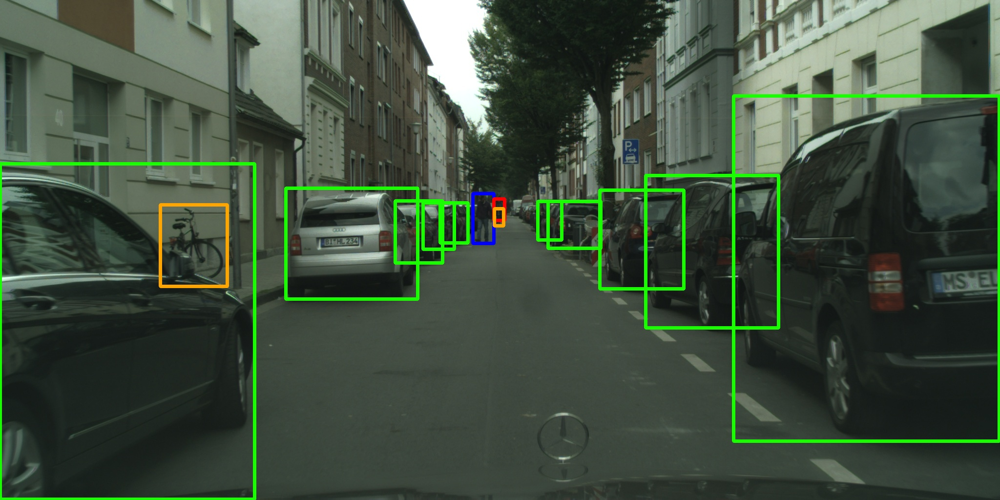

Video Mask R-CNN
==================================



This work is heavily based on [maskrcnn-benchmark](https://github.com/facebookresearch/maskrcnn-benchmark).

We tested the code on PyTorch 1.2.0 and CUDA 10.1

## Installation

Check [INSTALL.md](INSTALL.md) for installation instructions.

## Troubleshooting
Check [TROUBLESHOOTING.md](TROUBLESHOOTING.md).

## Citations
Please consider citing this project in your publications if it helps your research:

```
@Inproceedings{ltnghia-WACV2020,
  Title          = {Toward Interactive Self-Annotation For Video Object Bounding Box: Recurrent Self-Learning And Hierarchical Annotation Based Framework},
  Author         = {Trung-Nghia Le and Akihiro Sugimoto and Shintaro Ono and Hiroshi Kawasaki},
  BookTitle      = {IEEE Winter Conference on Applications of Computer Vision},
  Year           = {2020},
}
```

```
@Inproceedings{ltnghia-IV2020,
  Title          = {Attention R-CNN for Accident Detection},
  Author         = {Trung-Nghia Le and Akihiro Sugimoto and Shintaro Ono and Hiroshi Kawasaki},
  BookTitle      = {IEEE Intelligent Vehicles Symposium},
  Year           = {2020},
}
```

```
@misc{massa2018mrcnn,
author = {Massa, Francisco and Girshick, Ross},
title = {{maskrcnn-benchmark: Fast, modular reference implementation of Instance Segmentation and Object Detection algorithms in PyTorch}},
year = {2018},
howpublished = {\url{https://github.com/facebookresearch/maskrcnn-benchmark}},
note = {Accessed: [Insert date here]}
}
```

## Projects using Video Mask R-CNN

- [Toward Interactive Self-Annotation For Video Object Bounding Box: Recurrent Self-Learning And Hierarchical Annotation Based Framework](https://sites.google.com/view/ltnghia/research/video-self-annotation). 
  Trung-Nghia Le, Akihiro Sugimoto, Shintaro Ono, and Hiroshi Kawasaki.
  In proceeding WACV 2020.
  
 - [Attention R-CNN for Accident Detection] (https://sites.google.com/view/ltnghia/research/accident-detection). 
  Trung-Nghia Le, Akihiro Sugimoto, Shintaro Ono, and Hiroshi Kawasaki.
  In proceeding IV 2020.

------------------
The code is used for academic purpose only.

Contact: [Trung-Nghia Le](https://sites.google.com/view/ltnghia).

